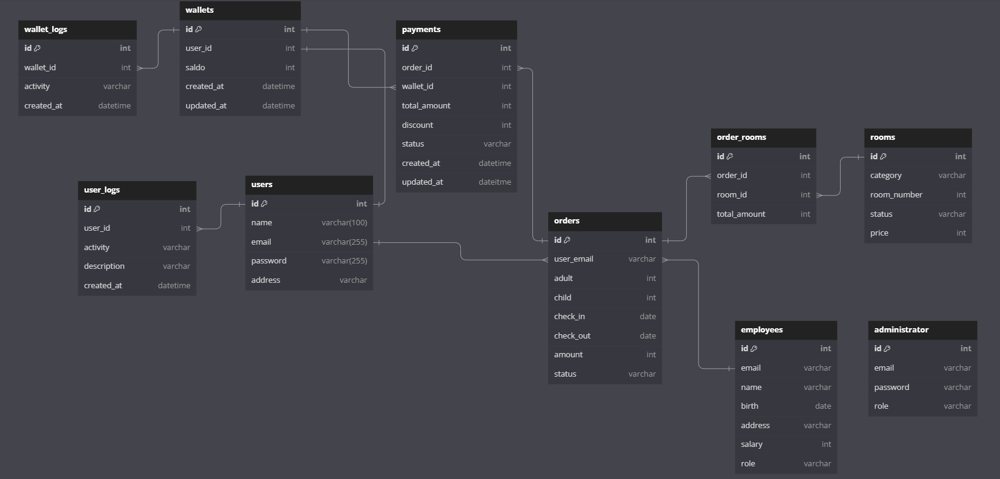

# Hotel Reservation - Mini Project

Note: Swagger API Documentation - Swagger Documentation - [localhost:8080/swagger/index.html](http://localhost:8080/swagger/index.html)

This application is designed to streamline the hotel booking process, focusing on the primary functions of room reservation and order cancellation.

## Key Features

### Order

The Orders within hotel reservation application plays a pivotal role in managing and tracking reservations made by users. It encompasses the entire lifecycle of a booking, from the initial reservation to payment processing and, if necessary, cancellation. This module ensures a seamless and organized process, enhancing the overall user experience.

### Payment

The Payments module is designed to facilitate secure and efficient financial transactions within the hotel reservation application. It ensures a smooth and reliable process for users to make payments for their reservations, enhancing trust and convenience. This module integrates seamlessly with a trusted third-party payment gateway, Xendit, to handle payment processing.

## Tech Stack

- Go
- Echo
- PostgreSQL
- Xendit
- SMTP
- Go Mail

## ERD

